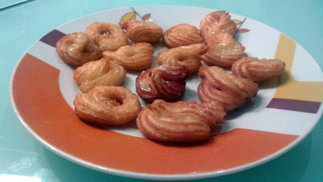

Crullers de naranja y miel
==========================

:tags: naranja,miel

Ingredientes (4 personas):

- 1 clara de huevo
- 1 huevo
- 125 ml de leche
- 15 gr de azúcar
- 45 gr de mantequilla
- 80 gr de harina
- Piel de naranja en un trozo (o de mandarina)
- Aceite
- Sal

Para el glaseado:

- 1 cucharada de café de agua
- 1 cucharada de café de miel
- 40 gr de azúcar glass

Preparación:

1. Poner en un cazo la leche, el azúcar, la piel de naranja y dejar que empiece
   a hervir.

2. Cuando comienze a hervir añadir la mantequilla y dejar que se deshaga.

3. A continuación retirar la piel de naranja y añadir la harina y un poco de
   sal, y remover. Dejar cocer 5 minutos a fuego suave para que pierda la
   humedad.

4. Retirar del fuego y añadir el huevo, integrarlo y luego añadir la clara.

5. Poner la masa en una manga pastelera con una boquilla rizada, y formar
   redondeces (como pequeños donuts) encima de papel sulfurizado.

6. Freirlos en aceite caliente hasta que estén dorados. Para mayor comodidad,
   recortar cada uno con su papel y echar directamente en el aceite. El papel se
   separará inmediatamente, y se podrá retirar.

6. Hacer el glaseado mezclando todos los ingredientes en un cazo.

7. Añadir el glaseado por encima sobre una reja (para que que el exceso se
   cole).
