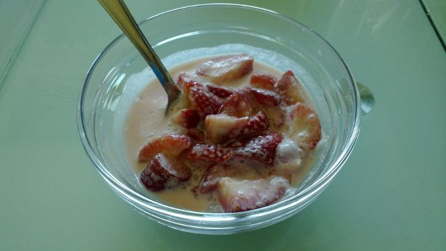

Fresas a la pimienta negra
==========================

:tags: fresa,fruta

Ingredientes:

- 1 kg de fresas o fresones
- 180 gr de azúcar
- 200 gr de nata líquida (35% mg)
- 50 ml de Grand Marnier o Cointreau
- Pimienta negra molida (media cucharada de café o 18 vueltes de un molinillo)

Preparación:

1. Lavar las fresas, retirar la parte verde, y cortarlas en 4 trozos
   (dependiendo del tamaño).

2. Poner las fresas en un bol con el azúcar. Mezclar con cuidado.

3. Añadir la pimienta negra y la nata, y volver a mezclar.

4. Finalmente, añadir el licor y volver a mezclar.

5. Guardar en la nevera (cubierto con un film transparente) al menos un par de
   horas.

6. Servir frío y decorado al gusto.

.. tip:: Mejor hacerlo al mediodía y servirlo a la noche, o hacerlo a la noche y
         servirlo al día siguiente.
