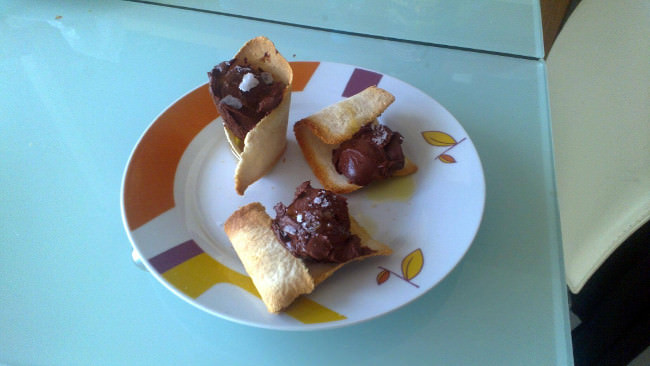

Pan con aceite y chocolate
==========================

:tags: pan,chocolate

Ingredientes (6 personas):

- 125 ml de leche
- 125 ml de nata líquida (mínimo de 32% mg)
- 200 mg de chocolate negro
- 2 yemas de huevo
- Pan de molde sin corteza
- Sal en escamas
- Aceite

Preparación:

1. Calentar la nata, la leche y el azúcar hasta que hierva.

2. Cuando empieze a hervir añadir la mezcla encima de las yemas y mezclar un
   poco.

3. Añadir el chocolate en trozos o pepitas y con la ayuda de una minipimer batir
   bien sin incorporar aire (es decir, con la minimiper al fondo sin levantar).

4. Cubrir bien con un film sin dejar ningún hueco con aire, y reservar en la
   nevera un mínimo de 4 horas.

5. Colocar las rodajas de pan entre dos films transparentes, y con la ayuda de
   un rodicho aplanar bien el pan.

6. Retirar el film y cortarlo en rectángulos (es decir, cortar el pan por la
   mitad).

7. Colocar el pan en una reja de horno, usando las propia reja para darle
   formas.

8. Tostar el pan en el horno a unos 200º hasta que estén dorados. Reservar.

9. Colocar una bola de chocolate junto con cadat trozo de pan. Añadir aceite y
   sal por encima y servir al momento.
