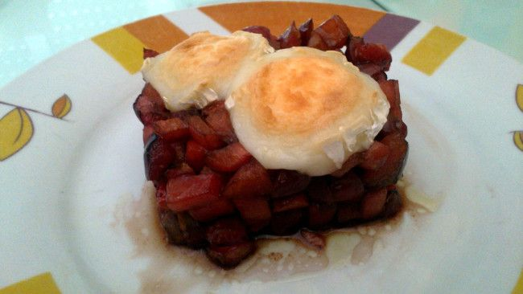

Cerezas, fresas y tomate
========================

:tags: cereza,fresa,tomate,fruta

Ingredientes (6 personas):

- 100 ml de Pedro Ximénez
- 100 ml de vinagre de módena
- 400 gr de cerezas
- 400 gr de fresas
- 400 gr de rulo de cabra
- 400 gr de tomate pera en tpm
- Aceite de oliva vírgen
- Flor de sal (o sal Maldon)

Preparación:

1. Poner en una cazuela el vinagre y el vino, encender el fuego y en cuanto
   empiece a hervir, dejar 2 o 3 minutos a fuego fuerte, para que
   reduzca. Retirar.

2. En un bol mezclar las cerezas cortadas a la mitad, las fresas cortadas al
   mismo tamaño que los trozos de cerezas, y el tomate en tpm (al mismo tamaño
   también). Mezclar con la reducción, la sal y un chorro de aceite de
   oliva. Dejar reposar en la nevera.

3. Montar con ayuda de un molde la mezcla, y poner por encima un trozo de queso
   de rulo.

4. Colocar en una bandeja de horno encima de papel sulfurizado (para poder
   retirar más facilmente) y gratinar unos minutos.

5. Servir decorado con unas hojas de ensalada de colores.

.. tip:: Alternativamente se puede presentar como un gazpacho, simplemente
         triturando toda la mezcla después del paso 2 (sin el queso). Consumir
         en 2 o 3 días.
