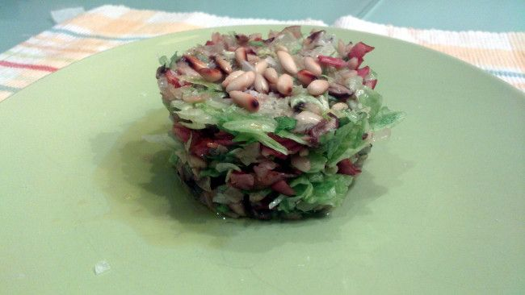

Ensalada tibia de setas y bacon
===============================

:tags: ensalada,bacon,seta

Ingredientes (4 personas):

- 1 bolsa de ensalada
- 100 gr de bacon cortado en trozos pequeños
- 2 cucharadas soperas de piñones
- 250 gr de mezcladillo de setas frescas
- Aceite de oliva
- Cebolla cortada en ciselé
- Pimienta
- Sal
- Vinagre

Preparación:

1. Poner en una cazuela la cebolla con aceite, y sofreír.

2. Cuando adquiera color, añadir las setas cortadas en trozos pequeños y unas
   gotas de vinagre. Dejar cocer a fuego bajo unos 10 o 15 minutos.

3. Saltear el bacon en una sartén y retirar. Reservar.

4. Saltear los piñones en una sartén y retirar. Reservar.
   
5. Lavar la ensalada, secarla y cortarla en juliana.

6. Preparar una vinagreta con la sal, la pimienta, 3 cucharadas soperas de
   aceite y 1 cucharada sopera de vinagre.

7. Mezclar la ensalada con la vinagreta, el bacon, los piñones (reservar unos
   cuantos) y la confitura de cebolla con setas.

8. Montar un timbal con ayuda de un molde. Decorar por encima con los piñones y
   por alrededor del plato con unos trozos de setas.

.. tip:: Se puede conservar en la nevera medio día, tapándolo con un papel de
         cocina mojado.
