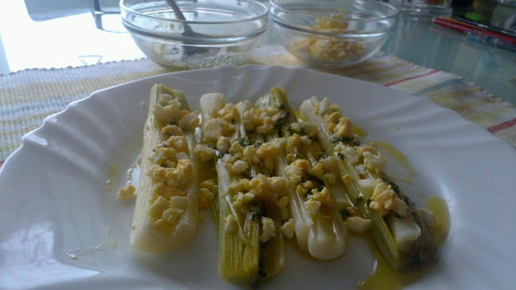

Puerros en vinagreta
====================

:tags: verdura,puerro

Ingredientes (6 personas):

- 1 kg de puerros
- 1 cucharada de café de mostaza
- 3 cucharadas soperas de vinagre
- 6 cucharadas soperas de aceite
- 2 huevos
- Cebollino
- Sal
- Pimienta

Preparación:

1. Cortar los puerros por la mitad a lo largo, y luego en dos o tres trozos
   dependiendo del largo. Cocerlos al vapor unos 20 minutos.

2. Mientras tanto, poner los huevos en un cazo con agua fria y cocerlos (unos 10
   o 12 minutos desde que rompe a hervir).

3. Preparar la vinagreta mezclando la mostaza, la sal, la pimienta y el
   vinagre. Una vez integrado añadir el aceite y el cebollino picado muy fino.

4. Repartir los puerros en los platos, cubrirlos con la vinagreta y espolvorear
   por encima con un poco de la yema del huevo.

5. Servir templado.

.. tip:: Como alternativa a los puerros se pueden emplear también espárragos
         blancos.
