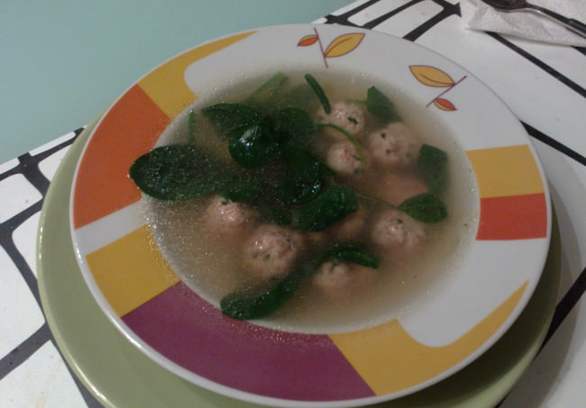

Albóndigas de cerdo y gambas en caldo aromático
===============================================

:tags: carne,cerdo,gamba,caldo

Ingredientes (4 personas):

- 300 gr de carne picada de cerdo
- 200 gr de gambas crudas sin pelar
- 1 cucharada sopera de cebollino picado
- 1 cucharada de café de jenjibre rallado
- 1 cebolleta
- 1 bolsa pequeña de espinacas baby
- Sal
- Pimienta
- Aceite de oliva

Para el caldo:

- 1 l de caldo de pollo o pescado
- 2 semillas de anís estrellado
- 1 trozo de jenjibre
- 1 o 2 cucharadas de café de salsa de soja (u otra salsa oriental, como salsa
  de ostras o salsa teriyaki)

Preparación:

1. Limpiar las gambas, pelarlas y trocearlas.

2. Preparar las albóndigas mezclando todos las gambas y el resto de los
   ingredientes en un bol, aderezarando bien con sal y pimienta. Formar las
   albóndigas y reservarlas en la nevera.

3. Poner el caldo en un cazuela y añadir el resto de los ingredientes, ponerlo a
   hervir y dejarlo durante 10 minutos a fuego mínimo.

4. Freir las albóndigas con abundante aceite a fuego medio y reservar sobre
   papel absorvente.

5. Añadir las albóndigas a la cazuela donde está el caldo caliente. Dejarlo 5
   minutos a fuego lento, añadir las hojas de las espinacas y la cebolleta
   cortada en rodajas, y retirar.
