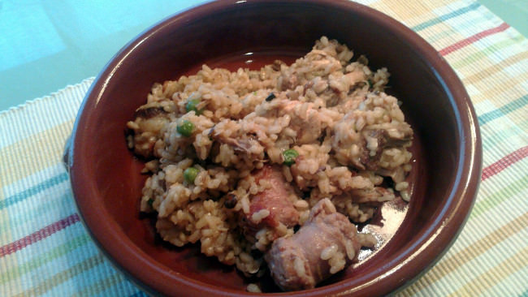

Arroz de montaña
================

:tags: arroz,carne,pollo,conejo,cerdo,butifarra

Ingredientes (4 - 6 personas):

- 1 cebolla
- 1 pimiento verde
- 200 gr de setas mezcladas
- 200 gr de salsa de tomate
- 50 gr de guisantes
- 500 gr de arroz (arborio, carnaroli o bomba)
- 2 dientes de ajo
- 1,5 l (mínimo) de caldo de pollo
- 1 butifarra troceada
- 1/4 de pollo troceado
- 1/4 de conejo troceado
- 1 trozo de costilla de cerdo
- Sal
- Aceite

Preparación:

1. Preparamos un caldo de pollo y lo reservamos caliente al fuego.

2. Pasar por una paella las setas con un poco de aceite, y reservar.

3. En una cazuela, añadir el aceite y sofreir la costilla, el conejo, la
   butifarra y el pollo. Dejarlos que se doren.

4. Añadir la cebolla y el pimiento picados finos y dejarlos un buen rato.

5. Añadir los ajos picados finamente, dejar que se dore e incorporar el
   tomate. Dejar hacerse el sofrito un mínimo de 35 a 40 minutos.

6. Cuando el sofrito esté hecho, incorporar las setas, los guisantes y el
   arroz. Darle vueltas hasta que el arroz comience a nacarar, y añadir el caldo
   que tendremos hirviendo, reservando un poco para el final.

7. Removemos un poco para que todos los ingredientes esté cubiertos por el
   caldo, rectificamos de sal y dejamos hervir (entre 14 y 17 minutos si es
   arroz tipo arborio o carnaroli, y entre 17 y 20 minutos si es tipo bomba; los
   5 primeros minutos a fuego fuerte y el resto a fuego suave sin que deje de
   hervir). Si es necesario podemos añadir un poco del caldo reservado.

8. Retiramos del fuego y dejamos reposar cubierto con un trapo. Remover antes de
   servir.
