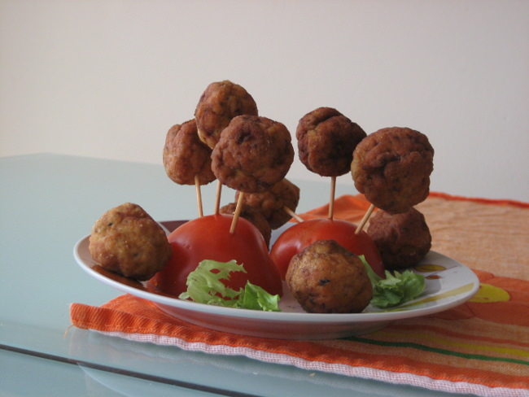

Chupa chups de pollo
====================

:tags: carne,pollo

Ingredientes (4 personas):

- 3 pechugas de pollo picadas
- 1 diente de ajo
- 1 cucharadita de pimentón
- 1/4 de cebolla
- 1 cucharada de perejil picado
- 2 cucharadas de harina
- 2 tomates
- Unas cucharadas de ketchup
- Aceite
- Sal
- Pimienta

Preparación:

1. Mezclar la carne de pollo con el ajo, el perejil y la cebolla picados y
   condimentándolo con el pimentón, la sal y pimienta.

2. Humedécete las manos, forma 20 albóndigas con el pollo picado y pásalas por
   harina. Pínchalas en palillos o pinchos de brocheta cortos.

3. Fríe las albóndigas en abundante aceite caliente hasta que estén doradas,
   retíralas y déjalas escurrir sobre papel absorvente de cocina.

4. Corta los tomates por la mitad, clava los chupa chups de pollo en ellos y
   sírvelos acompañados de ketchup.

