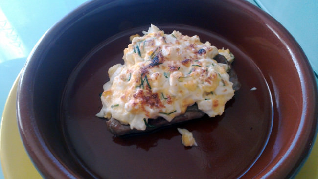

Lomos de atún gratinados con mahonesa
=====================================

:tags: pescado,atún

Ingredientes:

- 2 rodajas de atún fresco y limpio
- 150 ml de mahonesa (o lactonesa), mejor casera
- 1 huevo
- Cebollino

Preparación:

1. Cocemos el huevo.

2. En un bol poner la mahonesa, el huevo duro picado y el cebollino picado
   finamente. Mezclamos todo con una cuchara, y reservamos.

3. En una plancha o sartén pasamos las rodajas de atún.

4. Colocamos el atún en una bandeja para horno, y colocamos encima de cada
   rodaja la mezcla de mahonesa con huevo.

5. Introducimos en el horno a gratinar.

6. Cuando la superficie esté dorada, retirar y servir.
