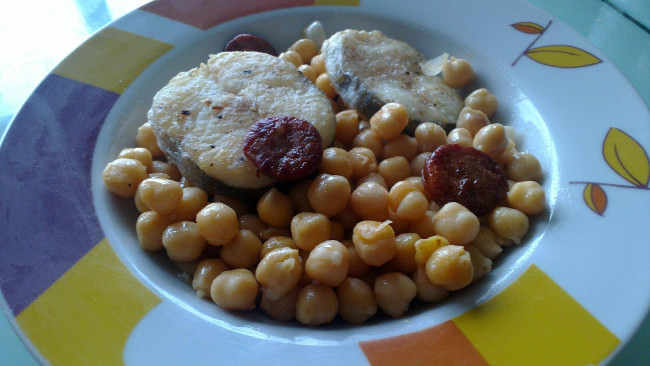

Merluza con chorizo y garbanzos
===============================

:tags: pescado,merluza,chorizo,garbanzo,legumbre

Ingredientes (4 personas):

- 4 rodajas de merluza
- 2 tazas de garbanzos cocidos
- 1/4 de chorizo
- 4 cucharadas de harina
- Aceite
- Sal
- Pimimenta
- Salsa alioli (opcional)

Preparación:

1. Salpimentar las rodajas de merluza, enharinarlas ligeramente y dorarlas en
   una sartén con un poco de aceite.

2. Cortar el chorizo en rodajas y saltearlo en una sartén. Cuando suelte la
   grasa, añadir los garbanzos y dejar que tomen sabor un par de minutos.

3. Distribuir los garbanzos con chorizo en los platos, y colocar una rodaja de
   pescado sobre ellos.

4. Si se desea, condimentar cada plato con una cucharada de salsa alioli.

.. tip:: Alternativamente se puede convertir este plato en una sopa. Para ello
         agregar 4 vasos de caldo de pescado a los garbanzos y dejarlos cocer
         unos minutos. Añadir a cntinuación la merluza cortada en dados,
         enharinada y frita, y cocerla unos minutos más.
