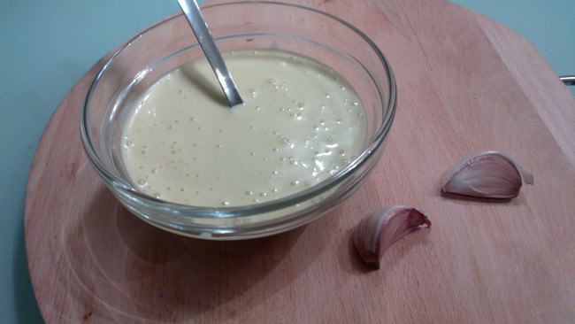

Salsa alioli
============

:tags: salsa

Ingredientes:

- 1 huevo
- 1 diente de ajo
- Aceite
- Sal

Preparación:

1. Colocar en un vaso de minipimer el huevo, el ajo troceado y sal.

2. Añadir aceite hasta cubrir (como mínimo dos dedos de aceite por encima, o
   bien hasta cubrir la cabeza de la minipimer).

3. Con la ayuda de una minipimer emulsionar hasta que quede todo bien ligado.

.. tip:: Se puede conservar la salsa en la nevera un máximo de dos días. Para
   ello cubrir el recipiente que contiene la salsa con un film transparente, de
   manera que toque la salsa y no quede ningún hueco con aire.
